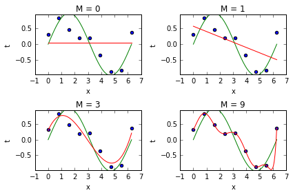
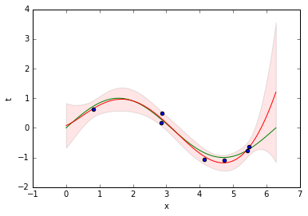
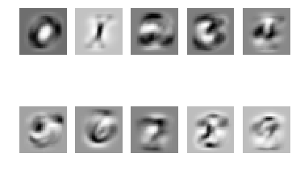
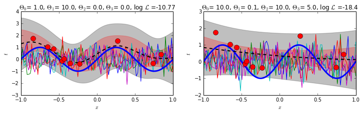

# Machine Learning

[](LICENSE)

## Description

Homeworks and code for the labs of the [Machine Learning 1](http://coursecatalogue.uva.nl/xmlpages/page/2016-2017-en/search-course/course/23348) and [Machine Learning 2](http://coursecatalogue.uva.nl/xmlpages/page/2017-2018-en/search-course/course/34043) courses of the MSc in Artificial Intelligence at the University of Amsterdam.

## Machine Learning 1

### Homeworks
- Probability Theory, Linear Algebra and Matrix Calculus: [Statement](ml1_hw/ml1_hw1.pdf) - [Solution](ml1_hw/HW1_gallegoposada.pdf)
- MAP Solution for Linear Regression, Probability Distributions, Likelihoods, and Estimators: [Statement](ml1_hw/ml1_hw2.pdf) - [Solution](ml1_hw/HW2_gallegoposada.pdf)
- Naive Bayes Classification and Multi-class Logistic Regression: [Statement](ml1_hw/ml1_hw3.pdf) - [Solution](ml1_hw/HW3gallegoposada.pdf)
- Constrained Optimization and Kernel Outlier Detection: [Statement](ml1_hw/ml1_hw4.pdf) - [Solution](ml1_hw/HW4_gallegoposada.pdf)
- PCA and Expectation Maximization for Mixture Models: [Statement](ml1_hw/ml1_hw5.pdf) - [Solution](ml1_hw/HW5_gallegoposada.pdf)

### Labs
#### Polynomial Regression and Bayesian Regression
Joint work with [Mathijs Mul](https://www.illc.uva.nl/MScLogic/people/show_person.php?Person_id=Mul+M.S.): [Assignment and Solutions](ml1_labs/lab1/lab01_mul_gallegoposada.ipynb)


Polynomial Regression             |  Bayesian Regression
:-------------------------:|:-------------------------:
  |  

#### Multi-Class Logistic Regression and Multi-Layer Perceptrons
Joint work with [Mathijs Mul](https://www.illc.uva.nl/MScLogic/people/show_person.php?Person_id=Mul+M.S.) and Kwesi Menyah: [Assignment and Solutions](ml1_labs/lab2/lab02_mul_gallegoposada_menyah.ipynb)

<p align="center">
  <br />
  <i>Learned Weights</i>
</p>

#### Gaussian Process Regression
Joint work with [Mathijs Mul](https://www.illc.uva.nl/MScLogic/people/show_person.php?Person_id=Mul+M.S.) and Sebastian Bertoli: [Assignment and Solutions](ml1_labs/lab2/lab03_mul_gallegoposada_bertoli.ipynb)

<p align="center">
  <br />
  <i>Gaussian Process Regression</i>
</p>

## Machine Learning 2

### Homeworks
- Probability Distributions, Multivariate Gaussians and Exponential Family: [Solution](ml2_hw/hw1_gallegoposada.pdf)
- D-Separation and Factor Graphs: [Solution](ml2_hw/hw3_gallegoposada.pdf)
- Expectation Maximization: [Solution](ml2_hw/hw4_gallegoposada.pdf)
- Sampling Methods and Variational EM: [Solution](ml2_hw/hw5_gallegoposada.pdf)
- Linear Systems and Causality: [Solution](ml2_hw/hw6_gallegoposada.pdf)

### Labs

Check my joint [repository](https://github.com/danakianfar/machine_learning_2_labs) with [Dana Kianfar](https://github.com/danakianfar).

## Testing
Refer to each lab and run the iPython notebook as follows.
``` 
jupyter notebook $notebook_name$.ipynb
```

## Dependencies
- iPython notebook
- SciPy
- NumPy
- Matplotlib

## Copyright

Copyright © 2016-2017 Jose Gallego.

<p align="justify">
This project is distributed under the <a href="LICENSE">MIT license</a>. This was developed as part of the Machine Learning 1 and 2 courses taught by Patrick Forré, Max Welling and Joris Mooij at the University of Amsterdam. Please follow the <a href="http://student.uva.nl/en/content/az/plagiarism-and-fraud/plagiarism-and-fraud.html">UvA regulations governing Fraud and Plagiarism</a> in case you are a student.
</p>
